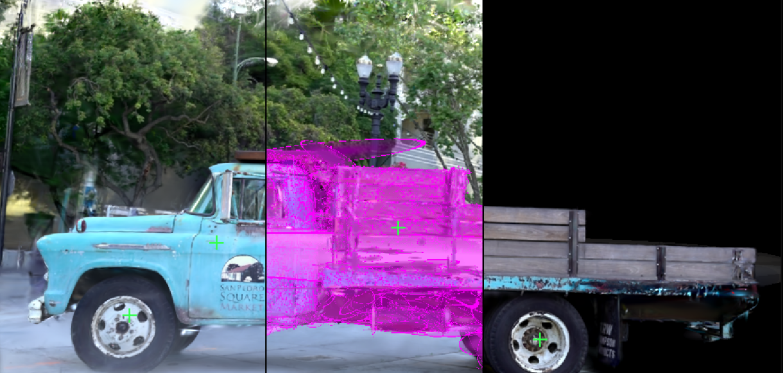
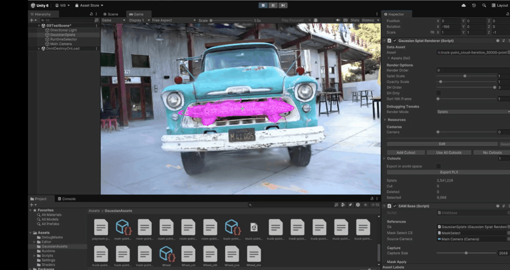

# Semi-Automatic View-Based Segmentation of Gaussian Splat Scenes

This project builds on **Aras Pranckevičius' Unity Gaussian Splatting renderer** and integrates it with:

- **SAM (Segment Anything Model)** to obtain a 2D segmentation mask from a single camera view.
- **ZoeDepth** to estimate depth in the same view and use that depth to prune the SAM selection in 3D.

The goal is **interactive, depth-aware selection of Gaussian splats in Unity**:
click on an object in the view, let SAM segment the corresponding 2D region, estimate the clicked surface depth with ZoeDepth, and deselect splats behind that depth to approximate the intended 3D object.

---



## High-Level Pipeline

### 1. Gaussian splats

A `.ply` file is converted offline into a Gaussian splat asset:

- Positions and other attributes are packed into GPU buffers such as `_SplatPos` and `_SplatColor`.
- Chunk-local AABBs and compact encodings such as 11-11-10 are used for compression.

At runtime, `GaussianSplatRenderer`:

- Uploads the asset to the GPU.
- Uses compute shaders such as `SplatUtilities.compute` to build per-splat **view data** (`SplatViewData`) for the active camera.
- Renders splats with `RenderGaussianSplats.shader`.

Important invariants:

- **Object, world, and camera spaces** follow standard Unity conventions.
  Local splat position -> `localToWorld` -> `worldToCamera` -> `GL.GetGPUProjectionMatrix`.
- Depth is computed as `clip.z / clip.w` and mapped to NDC `[0,1]` for depth gating.
- The position buffer (`_SplatPos` / `m_GpuPosData`) is a **packed `ByteAddressBuffer`**, not an array of `float3`.
  It must not be treated as `Vector3[]` on the CPU. Use the view buffer or decoded CPU-side asset data instead.

### 2. Central selection buffer: `_SplatSelectedBits`

All editing and selection flows through a single GPU bitfield:

- `GaussianSplatRenderer` owns `m_GpuEditSelected`, exposed as `GpuEditSelected`.
- In shaders this appears as `_SplatSelectedBits`, a **bit-per-splat** buffer.
- If a bit is `1`, the corresponding splat is selected for highlighting, deletion, labeling, or other downstream operations.

`UpdateEditCountsAndBounds()` scans `_SplatSelectedBits` on the GPU and computes:

- `editSelectedSplats`
- `editDeletedSplats`
- `editCutSplats`
- `editSelectedBounds`, the AABB of the selected splats

Any tool that modifies selection, including SAM, ZoeDepth, or future segmentation methods, must:

1. Set or clear bits in `_SplatSelectedBits`.
2. Call `UpdateEditCountsAndBounds()`.

This is the central contract for selection state.

## SAM and ZoeDepth Integration

### 3. Python sidecar (`cli_sam.py` and `SAM.py`)

A Python process runs alongside Unity and exposes a simple line-based protocol.

Each input JSON request includes:

- `image`: path to the captured RGB PNG
- `points`: positive click points in normalized image coordinates
- `out`: path to the SAM mask PNG
- `depth_out`: path to the ZoeDepth PNG
- `zoe_variant`, `zoe_root`, `zoe_max_dim`, and related options

For each request, the sidecar:

1. Runs **SAM** to produce a binary mask (`mask.png`) from the positive points.
2. Runs **ZoeDepth** to estimate a metric depth map `depth_raw` in meters.
3. Normalizes the per-frame depth map to `[0,1]`:

```python
d_min = np.min(depth_raw[finite])
d_max = np.max(depth_raw[finite])
depth_norm = (depth_raw - d_min) / max(d_max - d_min, 1e-6)
```

4. Writes a 16-bit depth PNG (`depth_out`) containing `depth_norm`.
5. Writes a `*_meta.json` file containing `depth_min`, `depth_max`, `depth_range`, and optional region statistics.

The sidecar does not know Unity units. It outputs:

- A SAM mask in image space
- A ZoeDepth map normalized to `[0,1]` for the current frame
- Metadata containing the original metric depth range

### 4. Unity SAM client (`SAMBase.cs`)

`SAMBase` coordinates capture, SAM, ZoeDepth, and selection inside Unity.

1. **Capture**

   - Captures a downsampled render from `sourceCamera` at `captureSize`
   - Saves it as a temporary PNG
   - Builds a JSON payload containing the image path, positive points, and output paths for mask and depth

2. **Call Python worker**

   - Starts `pythonExe` with `cli_sam.py --loop` once
   - Streams JSON requests over `stdin`
   - Waits for a JSON response or a timeout

3. **Load mask and depth**

   - Loads `maskTex` as an `R8` PNG
   - Loads `depthTex` from the ZoeDepth output PNG
   - Stores `m_LastMaskTex` and `m_LastDepthTex` for re-application

4. **Apply mask to selection** via `ApplyMaskToSelection(maskTex, depthTex)`

   - Calls `gs.EditDeselectAll()` to clear `_SplatSelectedBits`
   - Binds `_SplatViewData`, `_SplatPos`, `_MaskTex`, and optionally `_DepthTex`
   - Dispatches the `ApplyMaskSelection` kernel in `MaskSelect.compute`

   The kernel:

   - Projects each splat into the mask image using `SplatViewData.pos`
   - Samples the mask
   - Sets the corresponding bit in `_SplatSelectedBits` when the mask passes threshold
   - Optionally uses ZoeDepth and `_ZoeDepthCullOffset` to reject splats too far behind the 2D selection

   After dispatch, `GaussianSplatRenderer.UpdateEditCountsAndBounds()` is called so the editor state stays consistent.

5. **Depth probe** via `RunProbeCull()`

   Requires:

   - At least one positive point in `positivePoints[0]`
   - A valid `m_LastDepthTex`

   ZoeDepth is sampled at the clicked image coordinate:

```csharp
float zoeDepthNorm = depthTex.GetPixel(px, py).r; // 0..1
```

   The normalized depth is then mapped onto the camera ray:

```csharp
Ray ray = sourceCamera.ViewportPointToRay(new Vector3(pt.x, pt.y, 0f));
float metricDepth = Mathf.Lerp(nearMeters, farMeters, zoeDepthNorm);
Vector3 worldPos = ray.GetPoint(metricDepth);
float ndcDepth = WorldToNdc01(worldPos); // 0..1
```

   A tolerance band in NDC is computed with `ComputeProbeTolNdc`, which converts a metric tolerance into an NDC depth interval along the same ray.

   The result is stored in:

   - `m_ZoeProbeWorld`
   - `m_ProbeClipDepthNdc`
   - `m_ProbeClipTolNdc`

   The depth cull is then executed on either the CPU or GPU, depending on the active implementation.

6. **Plane visualization**

   `OnDrawGizmos` visualizes:

   - A blue plane at `m_ProbeForwardDepth` for the ZoeDepth probe
   - A red plane at `m_LastProbeCullForwardDepth` for the probe plus tolerance

   This provides immediate visual confirmation that the probe depth and tolerance are mapped correctly before culling is applied.

## Depth-Aware Culling

### 5. Depth band logic

Depth culling follows the rule:

- `D_splat`: splat depth in NDC
- `D_plane`: probed ZoeDepth plane in NDC
- `Delta`: tolerance in NDC

A splat is considered behind the plane when:

```text
D_splat > D_plane + Delta
```

Those splats have their bit cleared in `_SplatSelectedBits`.

Two implementations are supported conceptually.

#### A. GPU cull kernel

`CSProbeDepthCull` reads:

- `_SplatViewData`
- `_SplatSelectedBits`
- `_ProbeDepthClip`
- `_ProbeDepthClipTol`

Per splat:

- Exit early if the selection bit is not set
- Compute `depth01 = saturate(clip.z / clip.w * 0.5 + 0.5)`
- Compute `clipThreshold = _ProbeDepthClip + _ProbeDepthClipTol`
- Clear the selection bit if `depth01 > clipThreshold`

An optional debug mode can force all selected bits to be cleared to validate the pipeline independently of depth values.

#### B. CPU cull prototype

The CPU path:

- Reads `_SplatSelectedBits` into a `uint[]`
- Reads `_SplatViewData` into a `SplatViewDataCPU[]`
- Iterates over selected indices
- Converts `view.pos` to `depth01`
- Applies the same `depth01 > clipThreshold` rule
- Writes back the modified bit array
- Calls `UpdateEditCountsAndBounds()`

The critical constraint is that positions must never be decoded directly from `_SplatPos` on the CPU. Use `SplatViewData` or decoded asset data instead.

## Out of Scope

This project does not:

- Train SAM or ZoeDepth
- Perform view-consistent multi-view SAM fusion yet
- Rely on gradient-based optimization or heavy autograd pipelines

The current implementation is based on runtime compute shaders and straightforward depth-based filtering.

## Project Direction

The current focus is:

- **Robust interactive selection** of Gaussian splats in Unity via SAM
- **Depth-aware pruning** of that selection using ZoeDepth
- A clear pipeline that other tools can build on top of, including clustering, label painting, and export or import workflows

Possible extensions include:

- Training-free clustering over per-splat features such as color, position, and normals
- Multi-view fusion of SAM-based masks into a consistent 3D label field
- Open-vocabulary selection through per-segment text embeddings

## Implementation Notes

- Selection is only authoritative when it is represented in `_SplatSelectedBits` and `UpdateEditCountsAndBounds()` has been called.
- `_SplatPos` is a packed `ByteAddressBuffer`. Do not call `GetData<Vector3>` on it.
- Use `SplatViewData` for clip-space reprojection.
- Use decoded asset-level positions if CPU-side world-space access is required.
- Both compute and CPU-side projection use `worldToCameraMatrix` together with `GL.GetGPUProjectionMatrix(projection, true)`.
- Depth gating is always performed in NDC, with `clip.z / clip.w` mapped to `[0,1]`.
- ZoeDepth PNG outputs store **normalized** depth. The physically meaningful scale is stored in `*_meta.json` through `depth_min` and `depth_max`.

This document describes the current architecture and the assumptions that downstream tooling should preserve.
